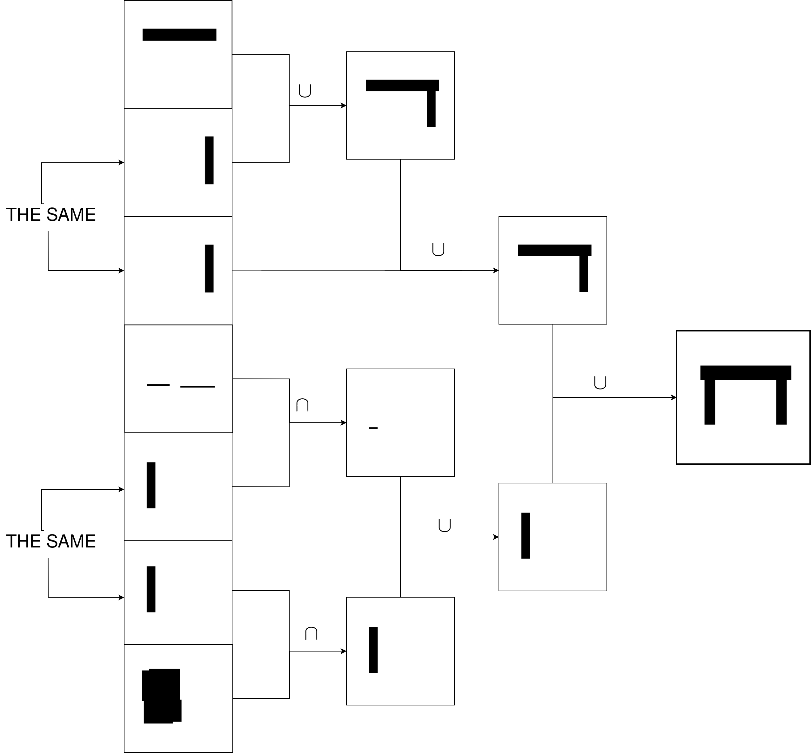
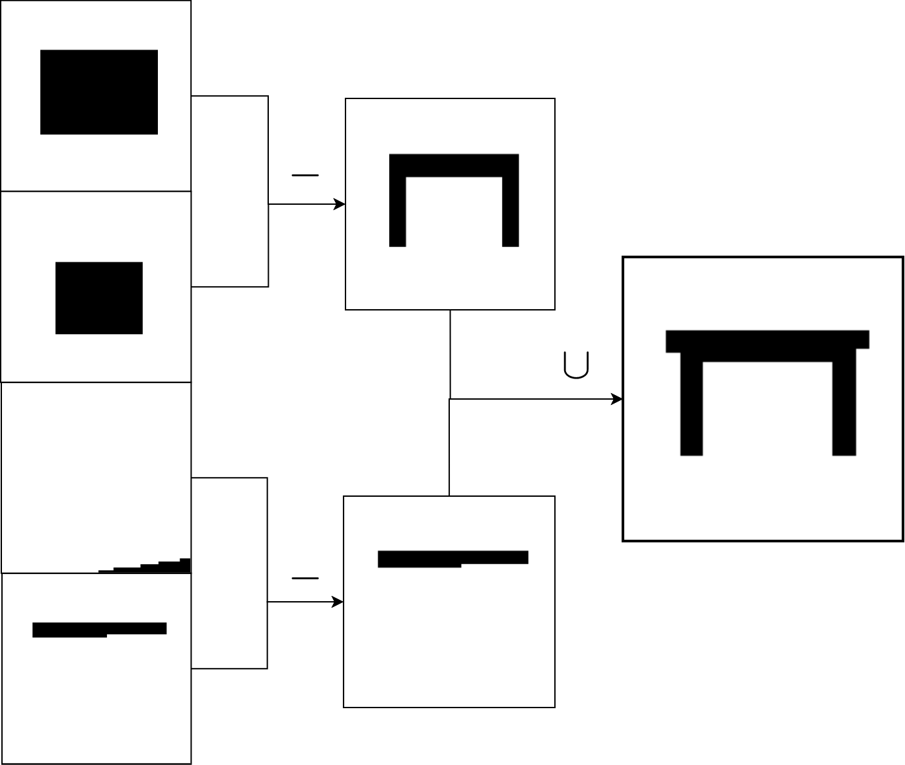
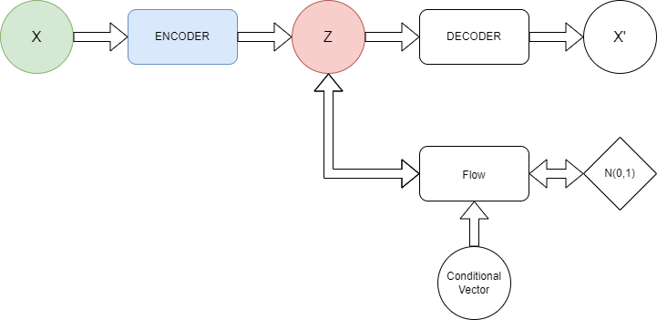
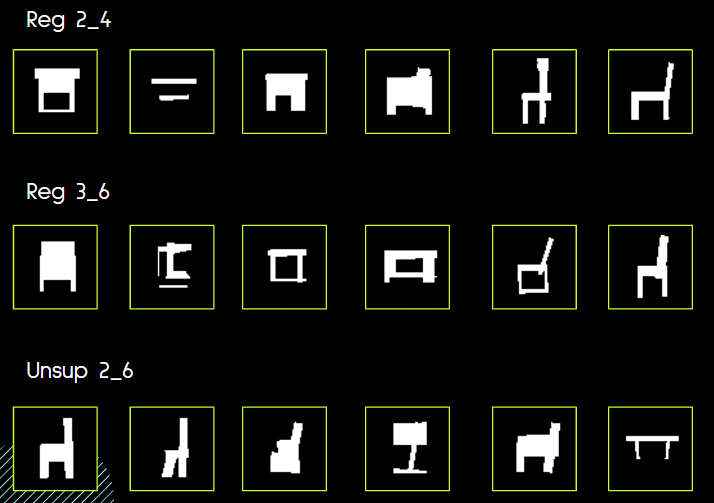

# ucsgnet-students-version

Bilski Kajetan, Chodukiewicz Maciej, Marciniak Michał, Woźniak Stanisław

Opiekun: [dr hab. inż. Maciej Zięba](https://scholar.google.com/citations?user=XmOBJZYAAAAJ&hl=en")

Repozytorium zawiera implementacje stworzeone przez studentów Politechniki Wrocławskiej w ramach projektu naukowo - wdrożeniowego. Tematem projektu było usprawnianie modeli generujących drzewa CSG. Drzewa CSG opisują w jaki sposób złożone kształty mogą zostać stworzone przez składanie prostych figur geometrycznych (prymitywów). Wszystkie zaimplementowane modele są oparte na [UCSG-Net](https://github.com/kacperkan/ucsgnet).

W gałęzi [supervised-training](https://github.com/sates298/ucsgnet-students-version/tree/supervised-training) znajduje się implementacja zawierająca dwie ważne usprawnienia. Główną wadą UCSG-Netu jest używanie nadmiarowych prymitywów w wygenerowanych drzewach, przez co są one większe niż to potrzebne. Pierwszym usprawnieniem zastosowanym w celu zmniejszenia generowanych drzew jest dodanie trójkątów do zbioru prymitywów. Domyślnie UCSG-Net jako prymitywy wykorzystuje jedynie koła i prostokąty. Drugim usprawnieniem jest zastosowania uczenia nadzorowanego z etykietami będącymi zbiorami prmitywów, znajdujących się w liściach optymalnych drzew CSG. Dodatkowo została zaimplementowana dodatkowa metryka (APU) mierząca ilość prymitywów w wygenerowanych drzewach (im niższa tym lepsza).

Przykładowe drzewo wygenerowane przez UCSG-Net

Drzewo wygenerowane przez naszą implementację

W gałęzi [flows](https://github.com/sates298/ucsgnet-students-version/tree/flows) znajduje się implementacja rozszerzająca model o zdolności generatywne. Osiągnięte jest to przez podpięcie pod reprezentację ukrytą przepływu normalizacyjnego. Pozwala to na generowanie nowych obiektów razem z ich drzewami CSG.

Schemat przedstawiający architekturę rozszerzonego modelu.

Przykładowe wygenerowane obiekty dla różnych wersji bazowego modelu.

Szczegóły są opisane w [raporcie](docs/GenWro_raport.pdf).

[Plakat projektu](https://www.canva.com/design/DAFEtumKRKk/rZmcapSp5oe-jJ8ERseg4w/view?utm_content=DAFEtumKRKk&utm_campaign=designshare&utm_medium=link2&utm_source=sharebutton)

[Prezentacja projektu](https://docs.google.com/presentation/d/16kwS6fBEt0N1YtiHIhLEn6unFHPxrlkFRtVg1kxA1Uk/edit?usp=sharing)
